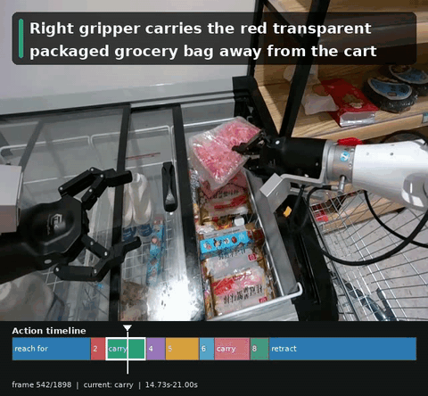

# Robot Action Segmentation

No-GT multi-view robot action segmentation with VLM-reviewed semantic decisions
and trajectory-assisted candidate recall.

<p align="center">
  
</p>

<p align="center">
  <a href="examples/agibot_demo/expected_outputs/task_388/episodes/685716/final/annotated_actions.mp4">Full demo video</a>
  ·
  <a href="examples/agibot_demo/expected_outputs/task_388/episodes/685716/final/timeline.html">Timeline HTML</a>
  ·
  <a href="examples/agibot_demo/expected_outputs/task_388/episodes/685716/final/final_segments.json">Final segments JSON</a>
</p>

This repository contains a no-ground-truth temporal action segmentation pipeline
for robot manipulation videos. It uses synchronized `head_color`,
`hand_left_color`, and `hand_right_color` observations to decide semantic action
states. CV and trajectory signals are used to recall candidate moments, but final
action labels and captions must come from an audited `codex_vlm_decision_v2`
visual review.

## Highlights

- No GT or `task_info` is used before prediction is locked.
- Final segments describe observable robot-object interaction states, not broad task summaries.
- Every boundary is snapped to a supplied sampled frame.
- Gripper close/open events are treated as timing candidates, not automatic grasp/release labels.
- Final videos show a one-line caption plus a bottom action timeline.
- Bundled AgiBotWorld demo cases include input videos, proprio CSV, VLM decisions, final JSON, timeline HTML, and annotated MP4 outputs.

## Pipeline

```text
Raw multi-view observation
        |
        v
Base head timeline + sampled frames
        |
        v
Synchronized tri-view evidence pack
        |
        +---- CV visual candidates
        +---- trajectory/proprio candidates
        |
        v
Codex/VLM semantic review
        |
        v
Final semantic action segments
        |
        +---- final_segments.json
        +---- timeline.html
        +---- annotated_actions.mp4
```

The maintained system contract is documented in
[`prompts/final_prompt.txt`](prompts/final_prompt.txt). The VLM decision prompt
is [`prompts/codex_vlm_decision_v2.txt`](prompts/codex_vlm_decision_v2.txt).

## Demo Outputs

The repo includes three compact demo cases under
[`examples/agibot_demo`](examples/agibot_demo):

| Task | Episode | Segments | Output video | Timeline | Final JSON |
| --- | ---: | ---: | --- | --- | --- |
| 327 | 685046 | 10 | [MP4](examples/agibot_demo/expected_outputs/task_327/episodes/685046/final/annotated_actions.mp4) | [HTML](examples/agibot_demo/expected_outputs/task_327/episodes/685046/final/timeline.html) | [JSON](examples/agibot_demo/expected_outputs/task_327/episodes/685046/final/final_segments.json) |
| 388 | 685716 | 9 | [MP4](examples/agibot_demo/expected_outputs/task_388/episodes/685716/final/annotated_actions.mp4) | [HTML](examples/agibot_demo/expected_outputs/task_388/episodes/685716/final/timeline.html) | [JSON](examples/agibot_demo/expected_outputs/task_388/episodes/685716/final/final_segments.json) |
| 446 | 687380 | 5 | [MP4](examples/agibot_demo/expected_outputs/task_446/episodes/687380/final/annotated_actions.mp4) | [HTML](examples/agibot_demo/expected_outputs/task_446/episodes/687380/final/timeline.html) | [JSON](examples/agibot_demo/expected_outputs/task_446/episodes/687380/final/final_segments.json) |

Each case keeps only the fixed tri-view input videos:

```text
observations/<task>/<episode>/videos/
  head_color.mp4
  hand_left_color.mp4
  hand_right_color.mp4
```

and the extracted proprio files:

```text
proprio_stats_extracted/<task>/<episode>/timeseries.csv
proprio_stats_extracted/<task>/<episode>/manifest.json
```

## Setup

```bash
python3.11 -m venv .venv
source .venv/bin/activate
pip install -r requirements-dev.txt
pip install -e .
pytest -q
```

For runtime-only use:

```bash
pip install -r requirements.txt
pip install -e .
```

## Run The Bundled Demo

This command processes the bundled demo observations and reuses the included
VLM-reviewed decisions as the locked final results:

```bash
python tools/run_no_gt_vision_traj_subset.py \
  --observations-root examples/agibot_demo/observations \
  --proprio-root examples/agibot_demo/proprio_stats_extracted \
  --output-root outputs/demo_vlm_reviewed \
  --reuse-output-root examples/agibot_demo/expected_outputs \
  --episodes-per-task 1 \
  --task-ids 327,388,446 \
  --views head_color,hand_left_color,hand_right_color \
  --sample-fps 4 \
  --candidate-count 16 \
  --trajectory-candidate-count 12
```

Expected outputs:

```text
outputs/demo_vlm_reviewed/
  annotated_videos/
  task_327/episodes/685046/final/
  task_388/episodes/685716/final/
  task_446/episodes/687380/final/
  no_gt_run_summary.json
```

## Single Episode Pipeline

```bash
python scripts/run_tas.py \
  --video examples/agibot_demo/observations/327/685046/videos/head_color.mp4 \
  --output-dir outputs/demo_single/task_327/episodes/685046/base_head_pipeline \
  --model codex-local \
  --sample-fps 4 \
  --window-size 16 \
  --window-stride 8 \
  --force

python scripts/prepare_multiview_codex_pack.py \
  --episode-dir examples/agibot_demo/observations/327/685046 \
  --output-dir outputs/demo_single/task_327/episodes/685046/multiview_pack \
  --sample-fps 4 \
  --views head_color,hand_left_color,hand_right_color \
  --trajectory-csv examples/agibot_demo/proprio_stats_extracted/327/685046/timeseries.csv \
  --candidate-count 16 \
  --trajectory-candidate-count 12 \
  --force

python scripts/apply_codex_vlm_decision.py \
  --pipeline-output-dir outputs/demo_single/task_327/episodes/685046/base_head_pipeline \
  --decision examples/agibot_demo/expected_outputs/task_327/episodes/685046/decision/codex_vlm_decision.json \
  --output-dir outputs/demo_single/task_327/episodes/685046/final
```

For a fresh run without `--reuse-output-root`, place each reviewed
`decision/codex_vlm_decision.json` under the target episode output directory
before the apply step. Do not use `--allow-bootstrap-decisions` for final
semantic results.

`--allow-bootstrap-decisions` is only a deterministic baseline/debug mode for
inspecting generated packs when no reviewed VLM decision is available. It is
off by default, and outputs produced through that mode must not be treated as
final semantic predictions.

The bundled `examples/agibot_demo/expected_outputs/` files are checked-in demo
artifacts. Their JSON paths are repo-relative so they can be reused or
re-rendered from the repository root with the bundled videos.

## Repository Layout

```text
robot_tas/        core sampling, schemas, segmentation, visualization, trajectory, and VLM-pack code
robot_tas/cli/    CLI implementations used by scripts and console entry points
scripts/          source-tree wrappers for the main pipeline steps
tools/            batch runner and final review/audit utilities
prompts/          maintained final runbook and VLM decision prompt
examples/         bundled AgiBotWorld demo cases and expected outputs
tests/            deterministic unit tests
```

## Final Output Contract

The final `final_segments.json` must satisfy these invariants:

- `prompt_versions.codex_vlm_decision == "codex_vlm_decision_v2"`
- every segment has concrete `description`, `action_label`, selected views, and left/right hand state
- every boundary uses a sampled `sample_index`, `frame_id`, and timestamp
- CV and trajectory evidence are recorded as support, not standalone semantic authority
- placeholder captions such as `visible item`, `target object`, or `active gripper` are not allowed

See [`docs/PIPELINE.md`](docs/PIPELINE.md) for the full runbook.
